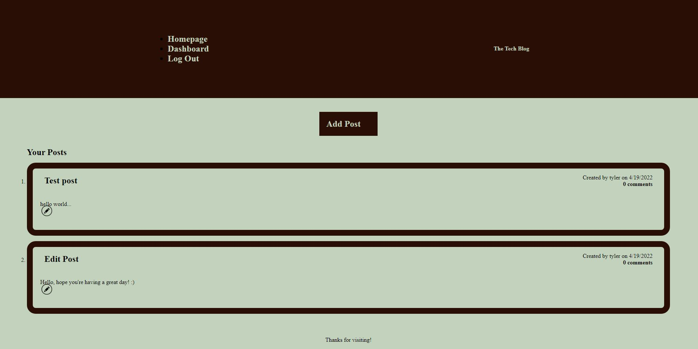

# Tech Blog

# Built With
- Node.js
- Express
- JavaScript
- MySQL
- Sequelize
- Handlebars

# Description
This application is a simple tech blog used to socialize with others. You are able to create an account, create new posts, comment on others posts, etc.

# Table of Contents
- [Description](#description)
- [Installation](#installation)
- [Usage](#usage)
- [Deployed-Application](#deployed-application)
- [Screenshot](#screenshot)

# Installation
- Create a `.env` file in the root of the application with the following format

DB_NAME=tech_blog
DB_USER=root
DB_PW=password

While changing the word "password" to your own password

- Clone the repository to your computer.
- Install dependencies `npm install`
- Connect to MySQL database by running `mysql -u root -p`, enter your password if prompted. From there you want to `SOURCE db/schema.sql`, then `USE tech_blog`, you can now quit out of MySQL.

# Usage
Once the installation for the application is completed, it is ready to be used. Run `npm run seeds` to seed the data, then `npm run start`. If you would like to skip locally installing this application, you can also use the deployed version, listed below.

# Deployed-Application
https://mvc-tech-blog-handlebars.herokuapp.com/

# Screenshot

# Made By
Tyler Sundquist